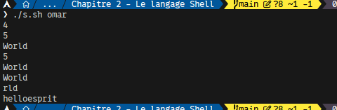
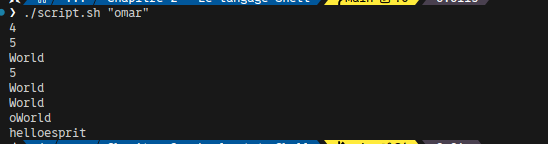

# Correction TP2-langage

## A. Manipulation des variables

1. Ecrire un programme afficheFormulaire qui demande de saisir votre nom,prénom et âge
   ensuite permet de les afficher.

```sh
#! /usr/bin/bash

function afficheFormulaire() {
  read -p "Saisir votre nom......" name
  read -p "Saisir votre prenom..." prename
  read -p "Saisir votre age......" age
  echo "$name $prename $age"
}

afficheFormulaire
```


1. Ecrire un programme copiedossier qui prend en argument deux noms des dossiers A et B et
   qui permet de les créer et de copier l’un dans l’autre.

```sh
#! /usr/bin/bash

function copiedossier() {
  if [ $# -ne 2 ]; then
    echo "Error: Messing Argument!"
    echo "Usage: ./script.sh Dossier_A Dossier_B"
    exit 1
  fi

  dirA=$1
  dirB=$2

  mkdir $dirA $dirB &&
    cp -r $dirA $dirB &&
    cp -r $dirB $dirA &&
    rmdir $dirA/$dirB/*
}

copiedossier $1 $2
```


1. Ecrire un programme effacerFichier qui détruit le fichier ou dossier passés en paramètre,
   mais, avant de l’effacer, le programme demande une confirmation pour effacement.

```sh
#! /usr/bin/bash

function effacerFichier() {
  if [ $# -ne 1 ]; then
    echo "Error: Messing Argument!"
    echo "Usage: ./script.sh [Dossier|fichier]"
    exit 1
  fi

  file=$1
  if [[ ! -d $file && ! -f $file ]]; then
    echo "Error: cannot delete directory/file!: directory/File not exist!"
    exit 1
  fi

  rm -r $file -i
}

effacerFichier $1
```


## B. Tableaux

1. Ecrire un programme Etudiant qui permet de créer un tableau contient cette liste des noms
   « ahmed, ali , mariem, soulaima, salim » et d’afficher le premier et le deuxième nom

```sh
#! /usr/bin/bash

function Etudiant() {
  # Ecrire un programme Etudiant qui permet de créer un tableau contient cette liste des noms
  # « ahmed, ali , mariem, soulaima, salim »  et d’afficher le premier et le deuxième  nom
  students=('ahmed' 'ali' 'soulaima' 'salim')
  echo ${students[0]} ${students[1]}

  # 2. Ajouter les noms « tarek, samer »  et afficher le nombre des étudiants
  students+=('tarek' 'samer')
  echo ${#students[*]}

  # 3. Ajouter le nom du votre délégué au début du tableau
  students=("Azize" "${students[*]}")


  # 4. Afficher Tous les éléments du tableau
  echo "${students[*]}"
}

Etudiant
```


## C. Expr : arithmétique

```sh
#! /usr/bin/bash

function arithmétique() {
  if [ $# -ne 2 ]; then
    echo "Error: Messing Argument!"
    echo "Usage: ./script.sh num1 num2"
    exit 1
  fi
  num1=$1
  num2=$2
  echo "$num1 + $num2 = $(expr $num1 \+ $num2)"
  expr "$num1 - $num2 = $(expr $num1 \- $num2)"
  expr "$num1 * $num2 = $(expr $num1 \* $num2)"
  expr "$num1 / $num2 = $(expr $num1 \/ $num2)"
}

arithmétique $1 $2
```



## D. Expr : manipulation des chaînes

```sh
#! /usr/bin/bash

# 1. Ecrire un programme chaines qui prend en paramètre une chaine de caractères  et  afficher sa longueur
function chaines() {
  expr length $1
}

# 2. On suppose que  la  chaine  de  caractères  est  helloWorld,  écrire  un  programme  sous-chaînes qui permet d’afficher la Longueur de 1er  sous-chaînes
function sous-chaines() {
  s="helloWorld"
  sub_s=${s:0:5} # sub_s="hello"
  echo "${#sub_s}"
}

# 3. Ecrire un programme Affichage-sous-chaînes qui prend en paramètre la chaine helloWorld et permet d’afficher la deuxième sous chaine
function Affichage-sous-chaines {
  s="helloWorld"
  sub_s=${s:5} # sub_s="World"
  echo "${sub_s}"
}

# 4. Ecrire un programme Position-numérique qui permet de donner la position du deuxième sous chaine de la chaine HelloWorld
function Position-numérique() {
  s="helloWorld"
  sub_s="World"
  index=${s%%$sub_s*}
  echo $((${#index}))
}

# 5. Ecrire un programme Last_Extraction  qui permet d’extraire les 5 dernier caractères   de la chaine helloWorld
function Last_Extraction() {
  s="helloWorld"
  echo "${s: -5}"
}

# 6. Ecrire un programme Suppression qui permet de Supprimer la plus petite correspondance entre h et o à partir du début de la chaine helloworld.
function Suppression() {
  s="helloWorld"
  h_pos=$(expr index "$s" "h") # Position de 'h'
  o_pos=$(expr index "$s" "o") # Position de 'o'
  sub_s="${s:h_pos-1:o_pos-h_pos+1}"

  echo "${s/$sub_s/}"
}

# 7. Ecrire un programme Suppression qui permet de Supprimer la plus grande  correspondance entre h et o à partir du début de la chaine helloworld.
function Suppression2() {
  s="helloWorld"
  h_pos=$(expr index "$s" "h")         # Position de 'h'
  o_pos=$(expr index "${s:h_pos}" "o") # Position de 'o' après 'h'
  o_pos_abs=$((h_pos + o_pos - 1))
  sub_s="${s:h_pos-1:o_pos_abs-h_pos+1}"

  echo "${s/$sub_s/}"
}

# 8. Ecrire un programme Remplacement qui permet de remplacer la première  correspondance de la sous chaine  world de la chaine helloworld avec esprit.
function Remplacement() {
  s="helloworld"
  echo "${s/world/esprit}"
}

chaines $1
sous-chaines
Affichage-sous-chaines
Position-numérique
Last_Extraction
Suppression
Suppression2
Remplacement
```


