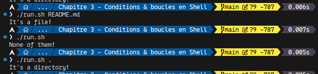
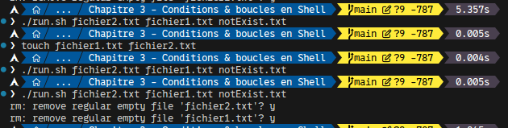
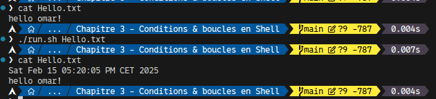
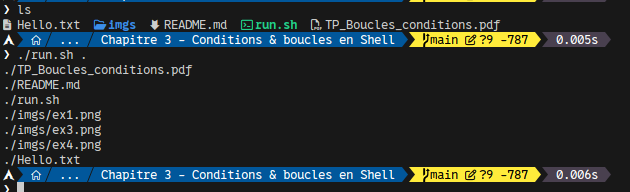
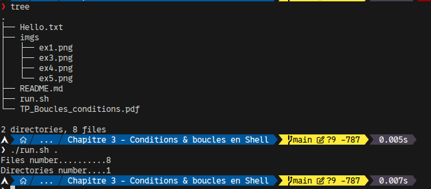
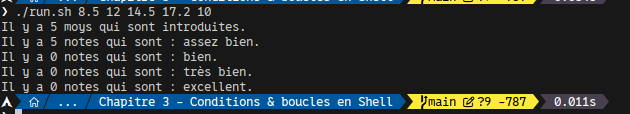
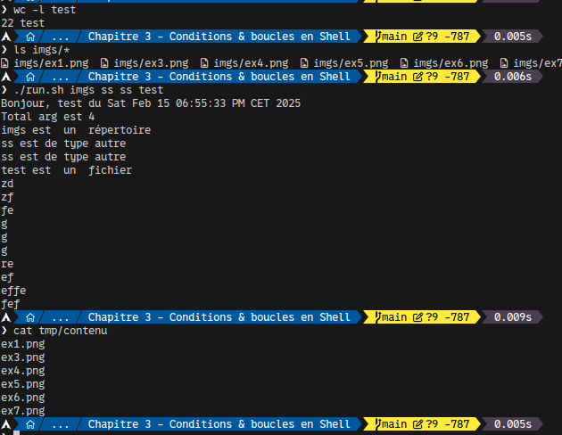

# TP3-Structures conditionnelles et itératives

## Exercise 1

```sh
#!/bin/bash

if [ -d "$1" ]; then
  echo "It's a directory!"
elif [ -f "$1" ]; then
  echo "It's a file!"
else
  echo "None of them!"
fi
```



## Exercise 2

```sh
#!/bin/bash

if [ $# -ne 1 ]; then
  echo "Usage: $0 <user_name>"
  exit 1
fi

USER_NAME=$1
SOURCE_DIR="/home/$USER_NAME"
ARCHIVE_DIR="ARCHIVES-$USER_NAME"

if [ ! -d "$SOURCE_DIR" ]; then
  echo "Error: $SOURCE_DIR doesn't exist!"
  exit 1
fi

# Create ARCHIVES-USERNAME if not exist
mkdir -p "$ARCHIVE_DIR"

cp -r "$SOURCE_DIR" "$ARCHIVE_DIR" || {
  echo "Error: Can't copy!"
  exit 1
}
```

## Exercise 3

```sh
#!/bin/bash

if [ $# -eq 0 ]; then
  echo "Usage: $0 <file> <file2> ..."
  exit 1
fi

for file in "$#; do
  if [ -f "$file" ]; then
    head -n 5 "$file"
    rm -i "$file"
  fi
done
```



## Exercise 4

```sh
#!/bin/bash

if [ $# -eq 0 ]; then
  echo "Usage: $0 <file>"
  exit 1
fi

echo -e "`date`\n`cat $1`" > $1
```



## Exercise 5

```sh
#!/bin/bash

if [ $# -eq 0 ]; then
  echo "Usage: $0 <Directory>"
  exit 1
fi

find $1 -type f
```



## Exercise 6

```sh
#!/bin/bash

if [ $# -eq 0 ]; then
  echo "Usage: $0 <dir_name>"
  exit 1
fi

echo -e "Files number..........$(find $1 -type f | wc -l)"
echo -e "Directories number....$(( $(find "$1" -type d | wc -l) - 1 ))"
```



## Exercise 7

```sh
#!/bin/bash

if [ $# -eq 0 ]; then
  echo "Usage: $0 <moy1> <moy2> ..."
  exit 1
fi

# Init counters
total=0
assez_bien=0
bien=0
tres_bien=0
excellent=0

for moy in "$@"; do
  if [[ ! "$moy" =~ ^[0-9]+(\.[0-9]+)?$ ]]; then
    echo "Warning: '$moy' not valid!"
    continue
  fi

  ((total++))

  if (($(echo "$moy < 10" | bc -l))); then
    ((assez_bien++))
  elif (($(echo "$moy >= 10 && $moy < 14" | bc -l))); then
    ((bien++))
  elif (($(echo "$moy >= 14 && $moy < 17" | bc -l))); then
    ((tres_bien++))
  elif (($(echo "$moy >= 17" | bc -l))); then
    ((excellent++))
  fi
done

# Display result
echo "Il y a $total moys qui sont introduites."
echo "Il y a $assez_bien notes qui sont : assez bien."
echo "Il y a $bien notes qui sont : bien."
echo "Il y a $tres_bien notes qui sont : très bien."
echo "Il y a $excellent notes qui sont : excellent."
```



## Exercise 8

```sh
#!/bin/bash

echo "Bonjour, test du $(date)"
echo "Total arg est $#"

if [ $# -ne 4 ]; then
  echo -e "\033[0;31mError: Expect 4 args\033[0m"
  echo -e "\033[0;34mUsage: $0 <arg1> <ag2> <ag3> <ag4>\033[0m"
  exit 1
fi

for file in $@; do
  if [ -d $file ]; then
    echo "$file est  un  répertoire"
    mkdir -p tmp
    touch tmp/contenu
    ls $file > tmp/contenu
  elif [ -f $file ]; then
    echo "$file est  un  fichier"
    line_count=$(wc -l < "$file")
    if [ $line_count -eq 0 ]; then
      echo "Le fichier est vide."
    elif [ $line_count -gt 20 ]; then
      head "$file"
    else
      cat "$file"
    fi
  else
    echo "$file est de type autre"
  fi
done
```


