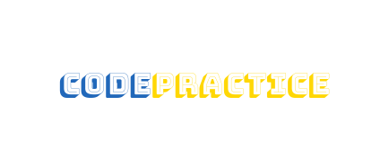

<!-- PROJECT SHIELDS -->

[](https://github.com/ZouariOmar/AgriGO/graphs/contributors)
[](https://github.com/ZouariOmar/AgriGO/network/members)
[](https://github.com/ZouariOmar/AgriGO/stargazers)
[](https://github.com/ZouariOmar/AgriGO/issues)
[](LICENSE)
[](https://www.linkedin.com/in/zouari-omar-143239283)

<!-- PROJECT HEADER -->
<h1 align="center">
  <br>
  <a href="https://github.com/ZouariOmar/Code-Practice"></a>
  <br>
  Code Practice
  <br>
</h1>

<h6 align="center">This repository contains my solutions to coding problems from various platforms. The solutions are implemented in different programming languages, primarily in C/C++. The problems are organized by their difficulty level and topic.</h6>

<!-- PROJECT LINKS -->
<p align="center">
  <a href="#about-the-project">About the Project</a> •
  <a href="#repository-structure">Repository Structure</a> •
  <a href="#usage">Usage</a> •
  <a href="#contributions">Contributions</a> •
  <a href="#license">License</a> •
  <a href="#contact">Contact</a> •
  <a href="#links">Links</a>
</p>

<!-- PROJECT TAGS -->


## About the Project

- `problems/easy/`: Solutions to easy problems.
- `problems/medium/`: Solutions to medium problems.
- `problems/hard/`: Solutions to hard problems.

Each subdirectory contains the solution files named according to the problem title or ID.

## Repository Structure

```bash
.Code Practice
├── atcoder
│   ├── AtCoder Beginners Selection
│   └── practice contest
├── codeforces
│   ├── Class A
│   ├── Class B
│   ├── Class C
│   └── Class D
├── codewars
│   ├── A
│   ├── Are You Playing Banjo?
│   ├── Bit Counting
│   ├── Break camelCase
│   ├── Calculating with Functions
│   ├── Calculator: Coin Combination
│   ├── Convert a linked list to a string
│   ├── Convert string to camel case
│   ├── Convert to Binary
│   ├── Count characters in your string
│   ├── Design a Simple Automaton (Finite State Machine)
│   ├── Double Char
│   ├── Duplicate Encoder
│   ├── Euclidean distance in n dimensions
│   ├── Find The Parity Outlier
│   ├── Find the sum of the roots of a quadratic equation
│   ├── Fix string case
│   ├── Friend or Foe?
│   ├── Going to zero or to infinity?
│   ├── Human Readable Time
│   ├── Interlocking Binary Pairs
│   ├── Is a number prime?
│   ├── Is this a triangle?
│   ├── Knight vs Bishop
│   ├── List Filtering
│   ├── Number
│   ├── Perimeter of squares in a rectangle
│   ├── Powers of i
│   ├── Product of consecutive Fib numbers
│   ├── Range Extraction
│   ├── Replace With Alphabet Position
│   ├── Reverse a number in any base
│   ├── Rot13
│   ├── Sentence Smash
│   ├── Simple Pig Latin
│   ├── Simple string characters
│   ├── Square Every Digit
│   ├── Sum of two lowest positive integers
│   ├── The spiraling box
│   ├── The Vowel Code
│   ├── Trilingual democracy
│   ├── Trolls are attacking your comment section!
│   ├── Two
│   ├── Unlucky Days
│   ├── V A P O R C O D E
│   ├── Vowel Count
│   ├── WeIrD StRiNg CaSe
│   └── Who likes it?
├── Custom
│   └── SimpleCliCalculator
├── edabit
│   ├── Easy
│   └── Very Easy
├── Esprit
│   └── 2A
├── geeksforgeeks
│   ├── Basic
│   ├── Easy
│   ├── Hard
│   └── Medium
├── hackerearth
│   ├── Easy
│   └── Medium
├── hakerrank
│   └── C++
├── interviewbit
│   ├── Easy
│   └── Very Easy
├── leetcode
│   ├── Contests
│   ├── Easy
│   ├── Hard
│   └── Medium
├── LICENCE
└── README.md

2034 directories, 3175 files
```

## Usage

Feel free to browse through the solutions and use them as a reference for your own learning. If you find any mistakes or have suggestions for improvements, please open an issue or submit a pull request.

## Contributions

1. Fork the repository.
2. Create a new branch: `git checkout -b feature-branch`
3. Make your changes and commit them: `git commit -m 'Add some feature'`
4. Push to the branch: `git push origin feature-branch`
5. Open a pull request.

## License

This repository is licensed under the **GPL License**. You are free to use, modify, and distribute the content. See the [LICENSE](LICENSE) file for details.

## Contact

For questions or suggestions, feel free to reach out:

- **GitHub**: [ZouariOmar](https://github.com/ZouariOmar)
- **Email**: [zouariomar20@gmail.com](mailto:zouariomar20@gmail.com)
- **LinkedIn**: [Zouari Omar](https://www.linkedin.com/in/zouari-omar-143239283/)

## Links

> [LeetCode Profile](https://leetcode.com/zouari_omar) -- [Geeksforgeeks Profile](https://www.geeksforgeeks.org/user/zouariouyfr) -- [GitHub Profile](https://github.com/ZouariOmar) -- [Linkedin Profile](https://www.linkedin.com/in/zouari-omar-143239283)
